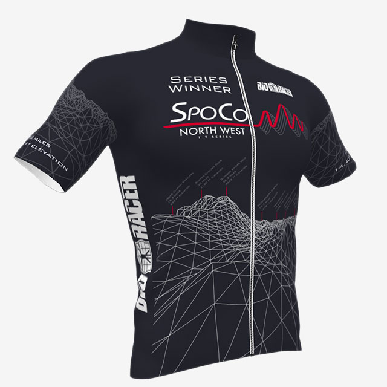
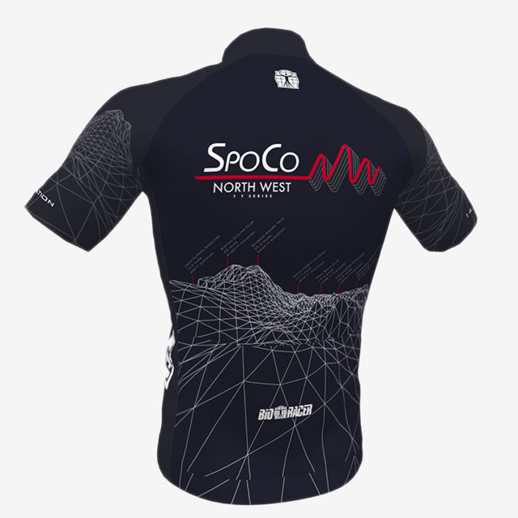

## 1. Sponsors and Prizes

<ul class="content__list">
	<li class="content__list-item">The competition is run on a points basis. Riders will be awarded points based on their finishing position within their gender category. First place in each category will be awarded 100 points, reducing by 1 point for each subsequent place, down to 10 points. After 91st place, all finishers will receive 10 points.</li>
	<li class="content__list-item">Series Winners&rsquo; jersey kindly designed and donated by <a href="http://www.onimpex.co.uk/">ONIMPEX-BIORACER UK</a>.</li>
</ul>

<figure class="fig">
	<picture class="fig__picture">
		
	</picture>
	<picture class="fig__picture">
		
	</picture>
</figure>

<figure class="fig fig--alt">
	
</figure>

